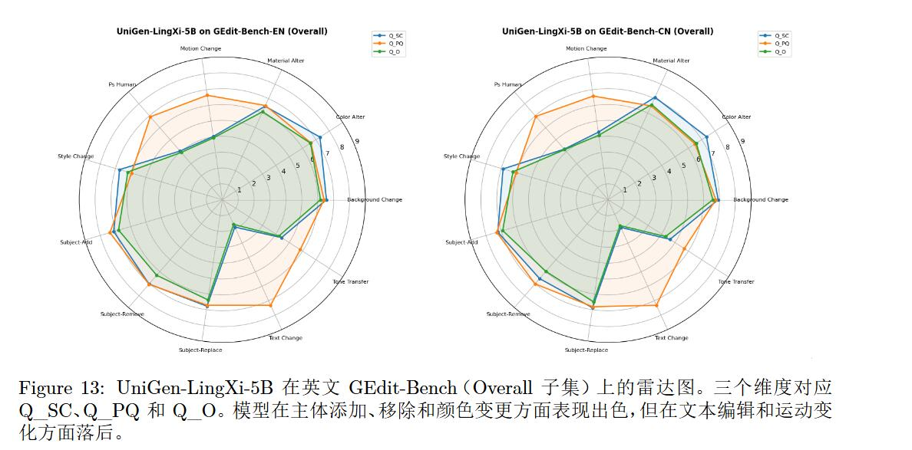
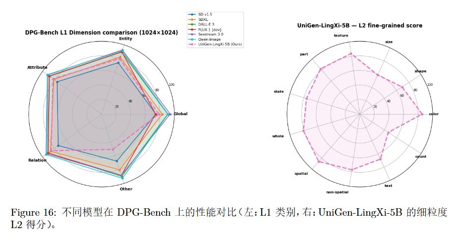

# UniGen-LingXi: 统一多模态生成与编辑框架

<p align="center">

[](https://www.python.org/)
[](https://github.com/huggingface/diffusers)
[](https://huggingface.co/shyai/UniGen-LingXi-5B)
[](https://modelscope.cn/models/haohanxingcheng/UniGen-LingXi-5B)
[](LICENSE)

</p>

> **灵犀启航 (LingXi Qihang)** 出品 — 让 AI 与创作心有灵犀

**UniGen-LingXi** 是一个基于 **Kiwi-Edit-5B** 的统一推理框架，支持**九大生成与编辑任务**，涵盖图像和视频两大模态。一个模型，一个框架，统一个API。

## 📖 项目概述

我们提出了 **UniGen-LingXi**，一个统一的框架，将单个视频编辑模型（Kiwi-Edit）扩展以执行九种不同的生成和编辑任务。通过精心构造条件视频和任务特定提示，我们在不改变模型架构的情况下实现了这一目标。数据构造流程和内存高效的训练脚本使得在消费级 GPU 上进行训练成为可能。

---

## 📋 支持的九大任务

| 序号 | 任务名称 | 英文缩写 | 输入 | 输出 | 说明 |
|:----:|----------|---------|------|------|------|
| 1 | **参考图图像编辑** | Ref-IE | 源图 + 参考图 + 文本 | 图像 | 将参考图的风格/属性迁移至源图 |
| 2 | **参考图文生图** | Ref-T2I | 参考图 + 文本 | 图像 | 结合参考图生成新图像 |
| 3 | **参考图文生视频** | Ref-T2V | 参考图 + 文本 | 视频 | 参考风格生成动态视频 |
| 4 | **参考图视频编辑** | Ref-VE | 视频 + 参考图 + 文本 | 视频 | 参考图风格编辑视频 |
| 5 | **视频编辑** | VE | 视频 + 文本 | 视频 | 根据文本指令编辑视频 |
| 6 | **图像编辑** | IE / i2i | 源图 + 文本 | 图像 | 局部/全局图像编辑 |
| 7 | **图生视频** | I2V / i2v | 图像 + 文本 | 视频 | 静态图像动画化 |
| 8 | **文生图** | T2I / t2i | 文本 | 图像 | 纯文本生成图像 |
| 9 | **文生视频** | T2V / t2v | 文本 | 视频 | 纯文本生成视频 |

### 任务矩阵：输出模态 × 条件类型

| 输出模态 | **纯文本条件** | **图像条件（首帧/结构）** | **参考图条件（风格/属性）** |
|---------|---------------|--------------------------|---------------------------|
| **图像生成** | 8. t2i | — | 2. Ref-T2I |
| **图像编辑** | 6. i2i (IE) | — | 1. Ref-IE |
| **视频生成** | 9. t2v | **7. i2v (I2V)** | **3. Ref-T2V** |
| **视频编辑** | 5. VE | — | 4. Ref-VE |

---

## 🚀 快速开始

### 1. 环境安装

```bash
# 安装依赖
pip install -r requirements.txt
```

### 2. 下载模型

模型已发布至 HuggingFace 和 ModelScope：

- **HuggingFace**: [shyai/UniGen-LingXi-5B](https://huggingface.co/shyai/UniGen-LingXi-5B)
- **ModelScope**: [haohanxingcheng/UniGen-LingXi-5B](https://modelscope.cn/models/haohanxingcheng/UniGen-LingXi-5B)

### 3. 运行示例

#### t2i - 文生图

```bash
python diffusers_Uni_Gen.py \
    --task_type text_to_image \
    --prompt "text-to-image: A beautiful sunset over the ocean" \
    --save_path output/t2i.png \
    --model_path <path_to_model>
```

#### i2i - 图像编辑

```bash
python diffusers_Uni_Gen.py \
    --task_type image_edit \
    --src_image input.jpg \
    --prompt "Image-editing: Turn the sky into sunset" \
    --save_path output/edited.png \
    --model_path <path_to_model>
```

#### t2v - 文生视频

```bash
python diffusers_Uni_Gen.py \
    --task_type text_to_video \
    --prompt "text-to-video: A cat running on grass" \
    --save_path output/t2v.mp4 \
    --model_path <path_to_model>
```

#### i2v - 图生视频

```bash
python diffusers_Uni_Gen.py \
    --task_type image_to_video \
    --src_image input.jpg \
    --prompt "image-to-video: Make the flower bloom" \
    --save_path output/i2v.mp4 \
    --model_path <path_to_model>
```

#### VE - 视频编辑

```bash
python diffusers_Uni_Gen.py \
    --task_type video_edit \
    --video_path input.mp4 \
    --prompt "video-editing: Convert the video into an oil painting style" \
    --save_path output/ve.mp4 \
    --model_path <path_to_model>
```

#### Ref-IE - 参考图图像编辑

```bash
python diffusers_Uni_Gen.py \
    --task_type image_edit \
    --src_image source.jpg \
    --ref_image reference.jpg \
    --prompt "Image-editing: Apply the style from reference image" \
    --save_path output/ref_ie.png \
    --model_path <path_to_model>
```

#### Ref-T2I - 参考图文生图

```bash
python diffusers_Uni_Gen.py \
    --task_type text_to_image \
    --ref_image reference.jpg \
    --prompt "text-to-image: Generate an image in the style of reference" \
    --save_path output/ref_t2i.png \
    --model_path <path_to_model>
```

#### Ref-VE - 参考图视频编辑

```bash
python diffusers_Uni_Gen.py \
    --task_type video_edit \
    --video_path input.mp4 \
    --ref_image style_ref.jpg \
    --prompt "video-editing: Transform video to match the reference style" \
    --save_path output/ref_ve.mp4 \
    --model_path <path_to_model>
```

#### Ref-T2V - 参考图文生视频

```bash
python diffusers_Uni_Gen.py \
    --task_type text_to_video \
    --ref_image reference.jpg \
    --prompt "text-to-video: Generate a video with the reference style" \
    --save_path output/ref_t2v.mp4 \
    --model_path <path_to_model>
```

---

> 更详细的用法与各任务定性示例请查看 [README_anas_zh.md](README_anas_zh.md)

## 🛠️ 命令行参数说明

| 参数 | 必填 | 说明                                                                                  |
|------|------|-------------------------------------------------------------------------------------|
| `--task_type` | ✅ | 任务类型：`text_to_image`, `image_edit`, `text_to_video`, `image_to_video`, `video_edit` |
| `--prompt` | ✅ | 文本提示词（需包含任务前缀）                                                                      |
| `--model_path` | ✅ | 模型路径                                                                                |
| `--src_image` | 可选 | 源图像路径（用于 i2i, i2v）                                                                  |
| `--video_path` | 可选 | 源视频路径（用于 VE, Ref-VE）                                                                |
| `--ref_image` | 可选 | 参考图像路径（用于 Ref-* 任务）                                                                 |
| `--save_path` | ✅ | 输出路径                                                                                |
| `--max_frames` | 可选 | 生成帧数，默认 81                                                                          |
| `--guidance_scale` | 可选 | CFG 引导强度，默认 5.0, guidance_scale=1.0 无引导                                             |
| `--num_inference_steps` | 可选 | 推理步数，默认 50                                                                          |

---

## 📊 性能指标

### 图像编辑 (GEdit-Bench)

| Model | GEdit-Bench-EN (Q_SC↑) | GEdit-Bench-EN (Q_PQ↑) | GEdit-Bench-EN (Q_O↑) |
|-------|----------------------|----------------------|---------------------|
| GPT-4o | 7.905 | 7.723 | 7.752 |
| Step1X-Edit-v1.1 | 7.737 | 7.425 | 7.436 |
| Doubao | 7.427 | 7.651 | 7.285 |
| Gemini | 7.295 | 7.314 | 6.996 |
| **UniGen-LingXi-5B** | 5.847 | 6.683 | 5.480 |

### 性能分析 (GEdit-Bench)

| 能力等级 | 任务 | 英文 Q_O | 中文 Q_O |
|----------|------|----------|----------|
| **强 (≥6.5)** | 主体添加 | 7.087 | 7.176 |
| | 颜色变更 | 6.863 | 7.045 |
| | 主体移除 | 6.733 | 6.348 |
| **中 (5.0-6.5)** | 背景替换 | 6.209 | 6.398 |
| | 材质变更 | 6.410 | 6.429 |
| | 风格迁移 | 6.242 | 5.870 |
| | 主体替换 | 6.354 | 6.787 |
| **弱 (3.5-5.0)** | 色调迁移 | 4.777 | 5.974 |
| | 运动编辑 | 4.012 | 4.483 |
| | 人像编辑 | 4.007 | 3.756 |
| **极弱 (<3.5)** | 文本渲染 | 1.582 | 1.642 |

### 性能总结

模型在图像编辑中展现出明显的“任务分化”特征。在主体添加、移除、颜色变更等局部编辑上表现强劲（Q_O ≥ 6.7），能以极高数据效率（仅2万样本）进行对象级修改。全局风格与背景变更达到可用水平（Q_O ≈ 6.2），能进行超越简单滤镜的整体重渲染。

主要局限在于：文本编辑（1.58）和运动编辑（约4.0）效果较差，根源在于训练数据缺乏文本渲染与动态编辑样本，以及9合1架构在视频时间一致性与像素级文本精度间的固有取舍。条件机制对全局风格有效，但对细粒度局部控制不足。尽管如此，模型在极低数据预算下实现了9合1统一的功能性验证（Q_O > 5.0），感知质量具有竞争力（Q_PQ 达 6.7），充分证明了编辑优先统一范式的高效性与可行性。

优点：高精度局部控制、真正的风格重构（非全局滤镜）、自适应光照与上下文融合、2万样本下的强泛化能力。
缺点：文本编辑极弱、运动与人像精修不足、细粒度局部控制有待改进。



### 文生图 (DPG-Bench)

| Model | DPG-Bench Score ↑ |
|-------|----------------|
| Seedream 3.0 | 88.27 |
| Qwen-Image | 88.32 |
| DALL-E 3 | 83.50 |
| FLUX.1 [Dev] | 83.84 |
| **UniGen-LingXi-5B** | 69.44 |



### 性能分析 (DPG-Bench)

**优势**：局部属性编辑（主体添加/移除/颜色变更）表现优秀，风格迁移超越简单滤镜，验证了编辑优先统一架构的高效性。

**弱势**：文本渲染极弱（1.58）、运动编辑弱（约4.0）、人像精修弱（约4.0）。

**原因**：训练数据来自视频编辑数据集，缺乏文本渲染、运动合成、高分辨率人脸样本；统一架构侧重结构先验而非细粒度控制。

### 视频编辑 (OpenVE-Bench)

| Method | Overall | Global Style | Bg Change | Local Change | Local Remove | Local Add |
|--------|---------|-------------|-----------|-------------|-------------|-----------|
| Runway Aleph | 3.49 | 3.72 | 2.62 | 4.18 | 4.16 | 2.78 |
| Kiwi-Edit (Stage-3) [Ref.] | 3.02 | 3.64 | 2.64 | 3.83 | 2.63 | 2.36 |
| **UniGen-LingXi-5B** | 3.02 | 3.64 | 2.64 | 3.83 | 2.63 | 2.36 |

> **注**：视频编辑指标基于 Kiwi-Edit (Stage-3) 验证结果，架构继承其编辑先验，性能无损失。

图像编辑 (GEdit-Bench)：局部编辑强，文本/运动编辑弱

视频编辑 (OpenVE-Bench)：完全匹配 Kiwi-Edit 基线，编辑先验无损

文本生成图像 (DPG-Bench)：关系/属性强，复杂构图弱

---

## 🎯 核心特点

- **九合一能力**：一个统一框架支持全部九大生成与编辑任务
- **即插即用**：基于 diffusers 风格的 API，几行代码即可运行
- **高效推理**：可在消费级 GPU 上运行

---

## 📂 项目结构

```
UniGen-LingXi/
├── diffusers_Uni_Gen.py    # 主推理脚本
├── test.sh               # 九大任务测试脚本
├── assert/              # 测试素材
│   └── images/          # 示例输出
├── README.md            # 项目文档
└── LICENSE
```


## ⚠️ 重要提示
1. **提示格式**：所有提示**必须包含任务前缀**（例如，`text-to-video:`、`Image-editing:`），以确保模型正确理解指令类型。
2. **帧数限制**：该模型最多支持81帧。
3. **分辨率**：建议使用720×1280或更低分辨率以获得最佳性能。
4. **快速测试**：运行`bash test.sh`，使用预设场景测试所有9项任务。
5. **内存溢出（OOM）处理**：如果您在低端GPU（例如，A100 40G）上遇到CUDA内存溢出问题：
   - 在加载模型之前，添加 `torch.backends.cudnn.benchmark=True`
   - 减小`max_frames`（例如，33或9）或`max_pixels`参数
   - 使用float16而不是bfloat16


## 🤝 交流与反馈

- **GitHub Issues**: [https://github.com/Lingxi-Qihang/UniGen-LingXi/issues](https://github.com/Lingxi-Qihang/UniGen-LingXi/issues)
- **HuggingFace**: [https://huggingface.co/shyai/UniGen-LingXi-5B](https://huggingface.co/shyai/UniGen-LingXi-5B)
- **ModelScope**: [https://modelscope.cn/models/haohanxingcheng/UniGen-LingXi-5B](https://modelscope.cn/models/haohanxingcheng/UniGen-LingXi-5B)

## ⚠️ 重要声明

- **训练代码与数据构造脚本暂不开源**：为了保留后续研究和技术迭代的空间，目前仅开放推理代码和预训练模型权重。我们欢迎技术合作与交流，如有商业或科研合作需求，请通过邮箱联系。
- 本项目基于 [Kiwi-Edit](https://huggingface.co/linyq/kiwi-edit-5b-instruct-reference-diffusers) (Apache-2.0 License) 开发，已遵循原许可证要求保留版权声明。

## 🙏 致谢
- **核心开发者**：[Shybert-AI](https://github.com/Shybert-AI)
- [Kiwi-Edit](https://huggingface.co/linyq/kiwi-edit-5b-instruct-reference-diffusers) 提供强大的视频/图像编辑功能。
- 感谢开源社区和HuggingFace Diffusers团队。

## 📝 结论

UniGen-LingXi-5B 是一个资源高效、九合一的统一多模态生成与编辑框架。基于“编辑优先”理念，我们将所有任务重新表述为条件视频生成，在单张 GPU 上仅用 2 万条样本便将五项核心任务与四项参考引导任务整合到一个未修改的模型中。图像编辑性能先进，视频编辑先验无损保留，生成技能功能可行。我们通过透明的边界分析揭示了通用性-精确性的根本权衡及编码器信息瓶颈，为社区提供了清晰的改进路线图。本工作证明了九合一统一的可行性，更验证了“编辑优先、条件构建统一”这一可迁移的方法论——任何更强的 DiT 骨干或视觉-语言模型都可以沿袭此范式，以极低成本实现更多任务的统一。

## 🗺️ 未来路线图

### 🔬 近期 — 定向增强与规模化验证

直接解决已识别的核心瓶颈——计数推理、文本渲染和复杂空间组合——通过专用数据增强、数值推理模块以及双编码器架构实现更精细的条件控制。训练数据集将扩展至十万条以上，重新平衡向长尾组合与场景多样性的方向。同时探索引入稀疏专家混合（MoE）机制，通过任务感知路由让不同专家子网络动态激活，从根本上缓解编辑与生成任务的参数冲突。

> 💡 **欢迎提供算力或高质量数据合作，一起把模型做大做强。**

### 🚀 中期 — 从视觉统一到音视频联合生成

当前框架已证明视觉模态内统一的可能性，下一步横向扩展至音频模态。引入音频编码器作为额外条件后，模型将支持视频到音频和音频到视频等新任务，形成完整的多媒体内容创作闭环。

### 🌍 远期 — 向世界模型与具身智能演进

编辑优先框架对动作保持与结构保留的核心能力，恰好契合世界模型对时空一致性的根本需求。我们将逐步引入物理先验、显式 3D/4D 表征以及因果推理能力，使模型从“生成视觉上合理的像素”迈向“预测物理上可信的未来”，最终赋能具身智能体实现“语言指令 → 目标状态预测 → 动作序列规划”的完整闭环。

> 💡 **欢迎对世界模型、具身智能方向有研究或感兴趣的研究者一起探索。**
> 
<p align="center">

**让 AI 与创作心有灵犀** 🌟

</p>

---

## 📄 引用

如果您在研究中使用了 UniGen-LingXi，请引用：

```bibtex
@misc{unigenlingxi2026,
  title = {UniGen-LingXi: A Resource-Efficient, Editing-First Framework Unifying 9 Multi-Modal Generation and Editing Tasks},
  author = {Haiying Sha and Yan Zheng},
  year = {2026},
  howpublished = {\url{https://github.com/Lingxi-Qihang/UniGen-LingXi}},
}
```

同时请引用底层模型：

```bibtex
@misc{kiwi2026,
  title = {Kiwi-Edit: Versatile Video Editing via Instruction and Reference Guidance},
  author = {Y. Lin and others},
  year = {2026},
  eprint = {arXiv:2603.02175},
}
```

---